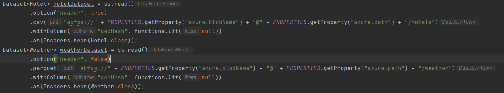
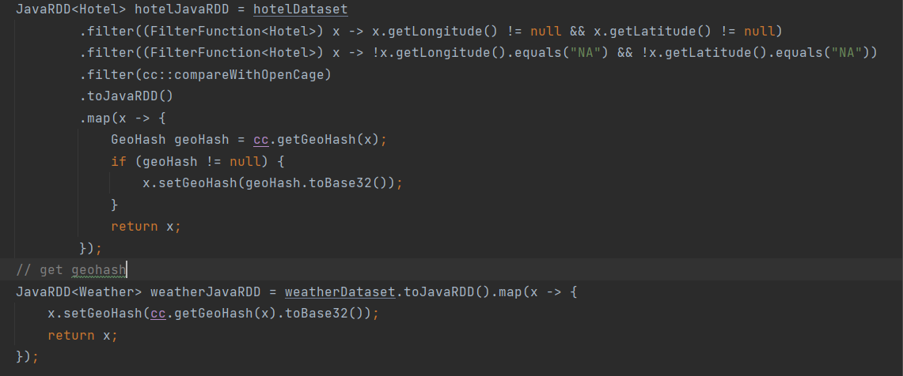
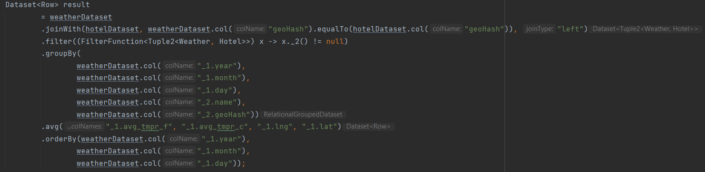
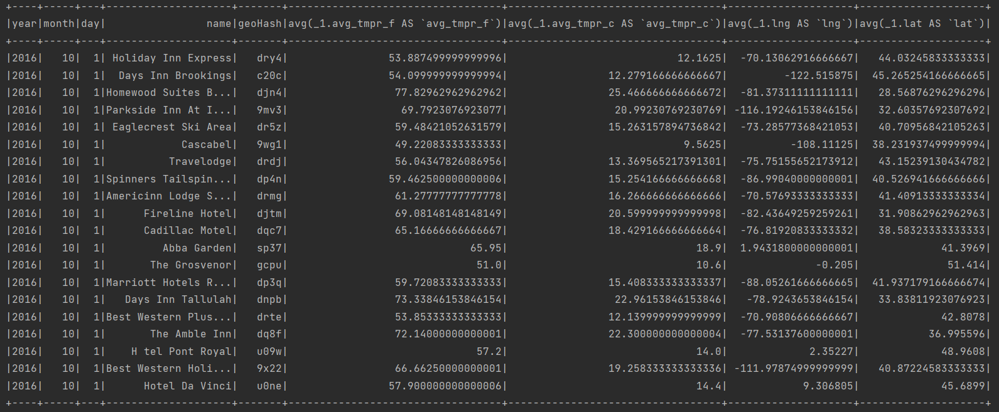
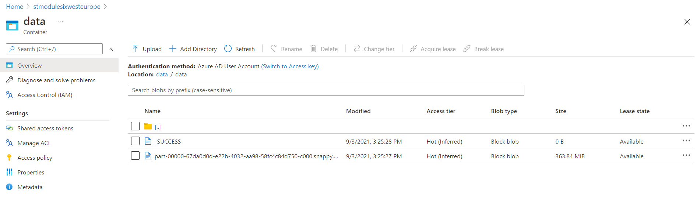

GitHub: https://github.com/ArtemBeltiukov/m06_sparkbasics_jvm_azure

* Download data and create datasets 

  
* Filtering hotels data and get geoHash for each row



* Left join datasets and grooming



* Get the results



* Build application with maven(dont forget to write credentials to application.properties)
* Build docker image and run

```
docker build . -t hotels:latest -f docker\Dockerfile
docker run hotels \
spark-submit \
--master k8s://https://sparkakscl-sparkcluster-5f194d-bdf8fad5.hcp.westeurope.azmk8s.io:443 \
--conf spark.kubernetes.file.upload.path=/mnt/m06 \
--class hotels.Main \
--deploy-mode cluster \
--executor-memory 8G \
--executor-cores 2 \
--name hotels \
--conf spark.executor.instances=1 \
--conf spark.kubernetes.container.image=fuskero.azurecr.io/spark:latest \
--conf spark.kubernetes.authenticate.driver.serviceAccountName=spark \
\target\sparkbasics-1.0.0-jar-with-dependencies.jar
```

Result of execution:



