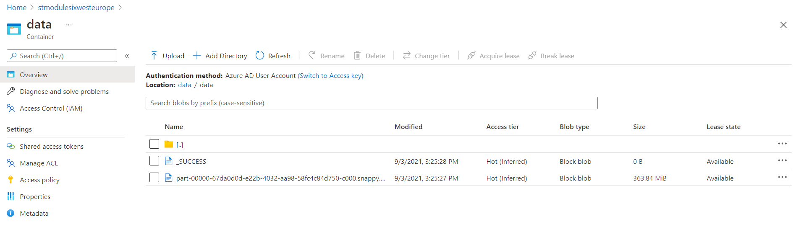

GitHub: https://github.com/ArtemBeltiukov/m06_sparkbasics_jvm_azure

* Download data and create datasets
```
        Dataset<Hotel> hotelDataset = ss.read()
                .option("header", true)
                .csv("abfss://" + PROPERTIES.getProperty("azure.blobName") + "@" + PROPERTIES.getProperty("azure.path") + "/hotels")
                .withColumn("geoHash", functions.lit(null))
                .as(Encoders.bean(Hotel.class));
        Dataset<Weather> weatherDataset = ss.read()
                .option("header", false)
                .parquet("abfss://" + PROPERTIES.getProperty("azure.blobName") + "@" + PROPERTIES.getProperty("azure.path") + "/weather")
                .withColumn("geoHash", functions.lit(null))
                .as(Encoders.bean(Weather.class));
```
* Filtering hotels data and get geoHash for each row
```
JavaRDD<Hotel> hotelJavaRDD = hotelDataset
                .filter((FilterFunction<Hotel>) x -> x.getLongitude() != null && x.getLatitude() != null)
                .filter((FilterFunction<Hotel>) x -> !x.getLongitude().equals("NA") && !x.getLatitude().equals("NA"))
                .filter(cc::compareWithOpenCage)
                .toJavaRDD()
                .map(x -> {
                    GeoHash geoHash = cc.getGeoHash(x);
                    if (geoHash != null) {
                        x.setGeoHash(geoHash.toBase32());
                    }
                    return x;
                });
```

* Left join datasets and grooming

```
Dataset<Row> result
                = weatherDataset
                .joinWith(hotelDataset, weatherDataset.col("geoHash").equalTo(hotelDataset.col("geoHash")), "left")
                .filter((FilterFunction<Tuple2<Weather, Hotel>>) x -> x._2() != null)
                .groupBy(
                        filter.col("_1.year"),
                        filter.col("_1.month"),
                        filter.col("_1.day"),
                        filter.col("_2.name"),
                        filter.col("_2.geoHash"))
                .avg("_1.avg_tmpr_f", "_1.avg_tmpr_c", "_1.lng", "_1.lat")
                .orderBy(filter.col("_1.year"), filter.col("_1.month"), filter.col("_1.day"));
```

* Get the results

```
+----+-----+---+------------------------------------------------------+-------+----------------------------------+----------------------------------+--------------------+--------------------+
|year|month|day|name                                                  |geoHash|avg(_1.avg_tmpr_f AS `avg_tmpr_f`)|avg(_1.avg_tmpr_c AS `avg_tmpr_c`)|avg(_1.lng AS `lng`)|avg(_1.lat AS `lat`)|
+----+-----+---+------------------------------------------------------+-------+----------------------------------+----------------------------------+--------------------+--------------------+
|2016|10   |1  |Cascabel                                              |9wg1   |49.22083333333333                 |9.5625                            |-108.11125          |38.231937499999994  |
|2016|10   |1  |Spinners Tailspin Inn                                 |dp4n   |59.462500000000006                |15.254166666666668                |-86.99040000000001  |40.526941666666666  |
|2016|10   |1  |Best Western Plus Arlington North Hotel and Suites    |drte   |53.85333333333333                 |12.139999999999999                |-70.90806666666667  |42.8078             |
|2016|10   |1  |Holiday Inn Express                                   |dry4   |53.887499999999996                |12.1625                           |-70.13062916666667  |44.03245833333333   |
|2016|10   |1  |Travelodge                                            |drdj   |56.04347826086956                 |13.369565217391301                |-75.75155652173912  |43.15239130434782   |
|2016|10   |1  |H tel Pont Royal                                      |u09w   |57.2                              |14.0                              |2.35227             |48.9608             |
|2016|10   |1  |Hotel Da Vinci                                        |u0ne   |57.900000000000006                |14.4                              |9.306805            |45.6899             |
|2016|10   |1  |Homewood Suites By Hilton Albuquerque - Journal Center|djn4   |77.82962962962962                 |25.466666666666672                |-81.37311111111111  |28.56876296296296   |
|2016|10   |1  |Marriott Hotels Resorts Suites                        |dp3q   |59.72083333333333                 |15.408333333333337                |-88.05261666666665  |41.937179166666674  |
|2016|10   |1  |The Grosvenor                                         |gcpu   |51.0                              |10.6                              |-0.205              |51.414              |
|2016|10   |1  |The Amble Inn                                         |dq8f   |72.14000000000001                 |22.300000000000004                |-77.53137600000001  |36.995596           |
|2016|10   |1  |Hampton Inn-st Robert                                 |9ywr   |60.40833333333335                 |15.783333333333333                |-92.26696666666668  |37.863616666666665  |

```

* Build application with maven(dont forget to write credentials to application.properties)
* Build docker image and run

```
docker build . -t hotels:latest -f docker\Dockerfile
docker run hotels \
spark-submit \
--master k8s://https://sparkakscl-sparkcluster-5f194d-bdf8fad5.hcp.westeurope.azmk8s.io:443 \
--conf spark.kubernetes.file.upload.path=/mnt/m06 \
--class hotels.Main \
--deploy-mode cluster \
--executor-memory 8G \
--executor-cores 2 \
--name hotels \
--conf spark.executor.instances=1 \
--conf spark.kubernetes.container.image=fuskero.azurecr.io/spark:latest \
--conf spark.kubernetes.authenticate.driver.serviceAccountName=spark \
\target\sparkbasics-1.0.0-jar-with-dependencies.jar
```

Result of execution:



